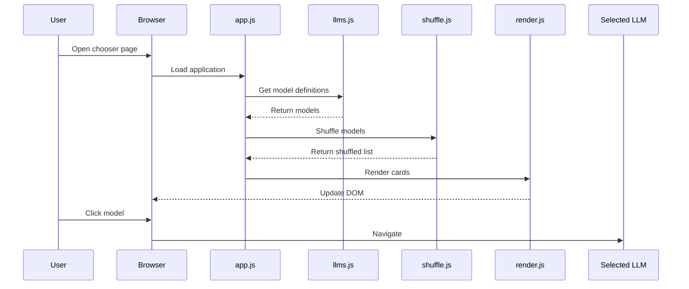
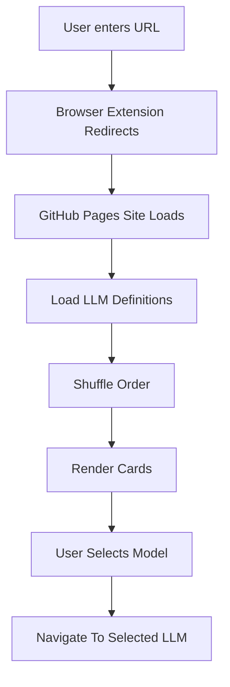
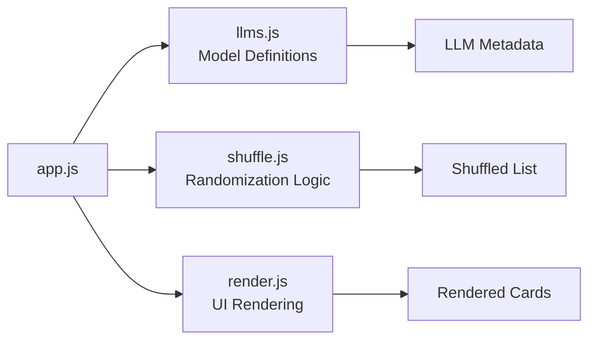
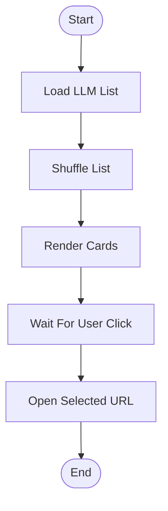
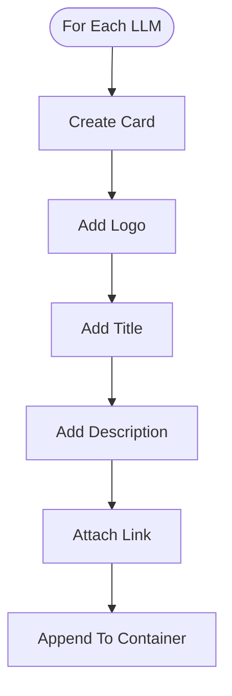
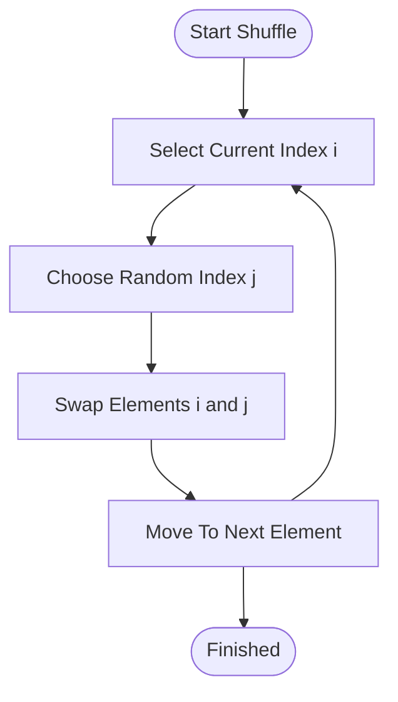
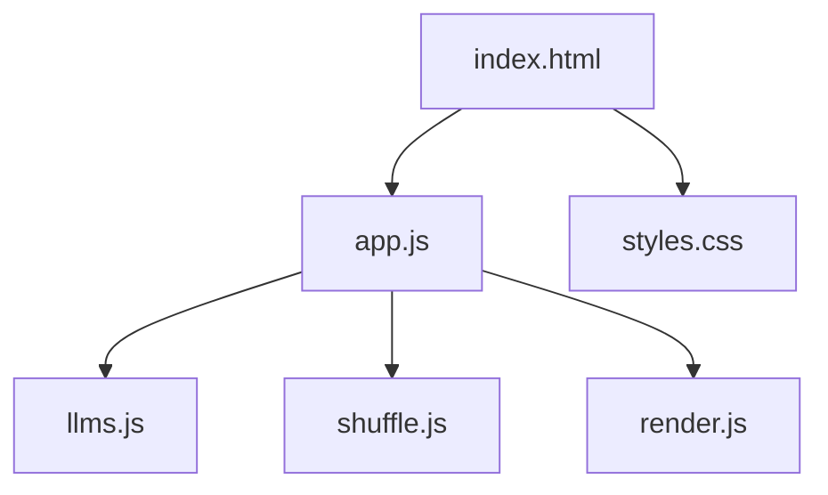
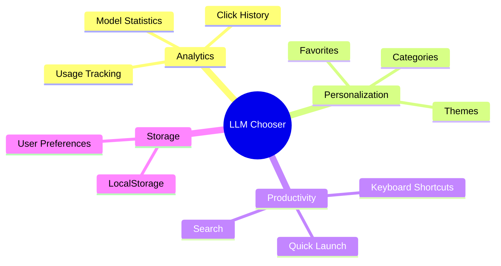

# LLM Chooser Developer Guide

## Purpose

The application interrupts automatic navigation to a specific LLM.

Instead of opening a model immediately, users consciously select from a shuffled list.

---

## Sequence Diagram



## High-Level Flow



---

## Component Responsibilities



| File | Responsibility |
|--------|--------|
| llms.js | Model definitions |
| shuffle.js | Randomization logic |
| render.js | UI rendering |
| app.js | Application orchestration |

---

## Application Startup

### Flow Diagram



### Pseudocode

```text
START

load llm list

shuffle llm list

render cards

wait for user click

open selected url

END
```

---

## Rendering Logic

### Flow Diagram



### Pseudocode

```text
FOR each llm

    create card

    add logo

    add title

    add description

    attach link

    append to page

END
```

---

## Shuffle Algorithm

### Flow Diagram



### Pseudocode

```text
FOR i from last element to first

    choose random index

    swap elements

END
```

---

## Runtime Dependency Diagram



---

## Future Enhancements



### Planned Features

- Usage analytics
- Keyboard shortcuts
- Categories
- Search
- Favorite models
- Dark/light themes
- LocalStorage statistics